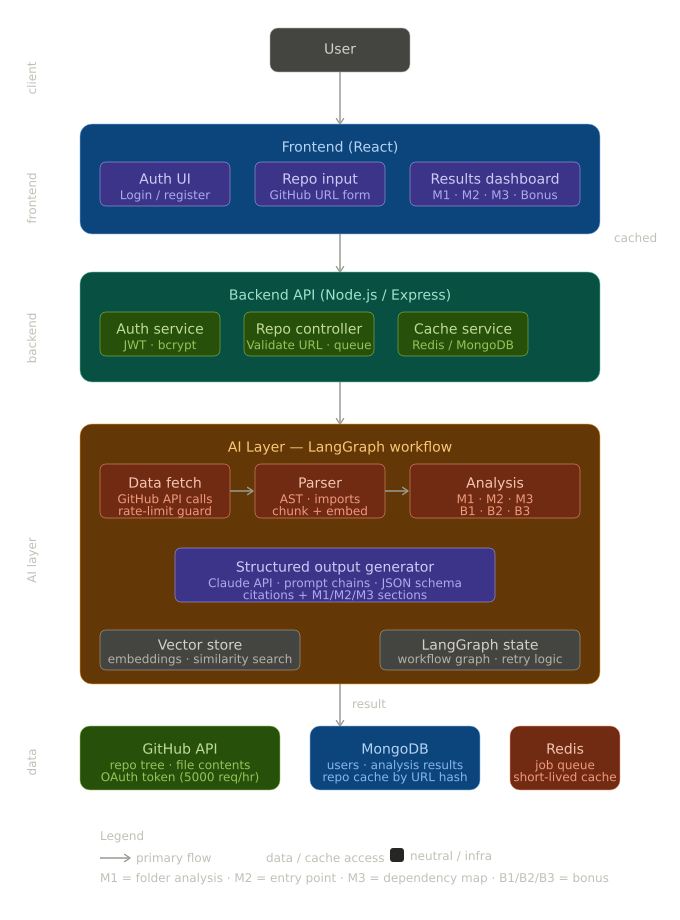
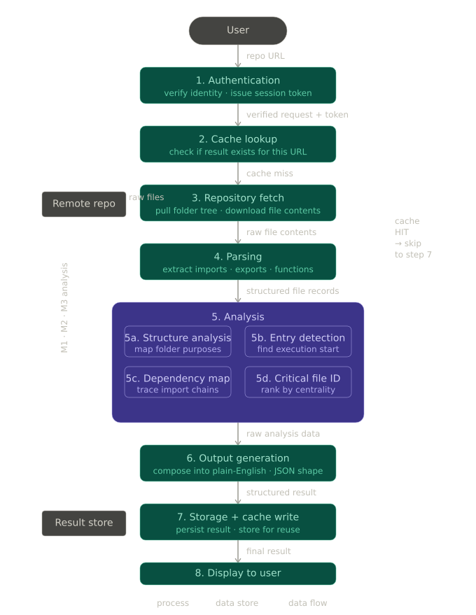
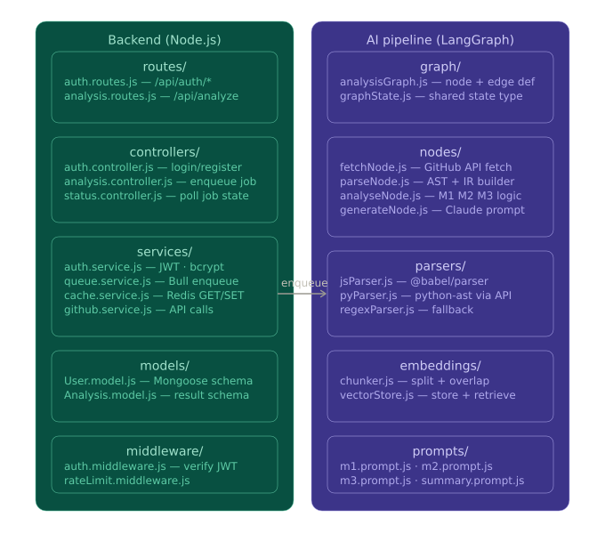

# CodeAstra — Project Manual

> **What it is:** An AI-powered codebase-intelligence agent. You give it a GitHub repo URL; it produces a structured, human-readable understanding of that project so a developer can onboard in minutes instead of days.
>
> **Rendered:** 2026-09-30 · Source of truth: `project-brief/manual.md`
>
> **This manual is the overview/cover.** Deep per-feature and per-component detail lives in `project-brief/chapters/` (each rendered to its own PDF):
>
> | # | Chapter | Covers |
> |---|---------|--------|
> | 00 | Overview & Architecture | this manual's content, condensed with diagrams |
> | 01 | M1 — Folder Structure Analysis | feature: folder purpose + categories |
> | 02 | M2 — Entry Point Detection | feature: entry file + execution flow |
> | 03 | M3 — Dependency Mapping | feature: import graph + ASCII tree |
> | 04 | AI Pipeline & LangGraph | state, models, graph, combine, resilience, fallback |
> | 05 | Ingestion — GitHub & Parser | tree fetch, batching, regex parser |
> | 06 | API, Controller & Data Layer | endpoint, caching, DAO, Mongo schema |
> | 07 | Frontend — Architecture & Flow | routes, context, real-vs-mock |

---

## 1. One-paragraph summary

CodeAstra takes a **GitHub repository URL**, fetches the repo tree and source files, parses them into an intermediate representation (imports/exports/functions), then runs a **LangGraph** pipeline of three parallel LLM analyses and returns a combined result. A **React SPA** consumes that result and renders it as a dashboard, folder tree, dependency graph, and insights.

The three core analyses (the product's mandatory features):

| Module | Name | What it produces |
|--------|------|------------------|
| **M1** | Folder Structure Analysis | Purpose of each major directory, in plain English, categorized (entry/logic/config/utility/test/other). |
| **M2** | Entry Point Detection | The app's starting file + an ordered execution-flow description. |
| **M3** | Dependency Mapping | Import/export graph between files + an ASCII tree + reverse-dependency (`importedBy`) info. |

---

## 2. Tech stack

**Backend** — Node.js, Express 5, TypeScript, MongoDB (Mongoose), LangGraph + LangChain core, **NVIDIA Nemotron** LLMs (via the OpenAI-compatible endpoint `integrate.api.nvidia.com/v1`), GitHub API (Octokit), Zod.

> ⚠️ **Doc-vs-code note:** `.docs/PROJECT_ANALYSIS.md` says Groq/Llama and `.docs/AI_PIPELINE.md` says Gemini — **both are stale.** The actual code in `backend/src/ai/model.ts` uses NVIDIA Nemotron (`nemotron-3-nano-30b-a3b` for M1, `nemotron-3-super-120b-a12b` for M2 & M3), all `temperature: 0`, keyed by `NVIDIA_API_KEY`.

**Frontend** — React 19, TypeScript, Vite, TailwindCSS 3, framer-motion, React Router v7, ReactFlow (`@xyflow/react`) + dagre for graph layout.

---

## 3. Visual architecture

### 3.1 Full system architecture



### 3.2 Data flow



### 3.3 Low-level module structure



### 3.4 Backend architecture (ASCII)

```
Client (GitHub URL)
   │
   ▼
Express API (Port 4000)  →  Analysis Controller  (POST /api/analysis)
   │
   ├─ SHA256(repoUrl) → MongoDB cache check ── hit ──▶ return cached
   │                                          miss
   ▼
AI Service (orchestrator)
   1. GitHub Service: getRepoTree() → filterDirs() → detectEntryCandidates()
   2. GitHub Service: getSourceFiles()  [5 parallel, 100ms delay, 60-file cap]
   3. Parser Service: parseRepo() → imports/exports/functions (IR)
   4. Resolve entry-file contents (top 3 candidates)
   5. Run LangGraph pipeline
   │
   ▼
LangGraph:   START → [ M1 ∥ M2 ∥ M3 ]  →  Combine  →  END
   │                (parallel fan-out)     (fan-in)
   ▼
IAnalysisResult (m1 + m2 + m3)
   │
   ▼
DAO markCompleted → save to Mongo → return JSON to client
```

---

## 4. Backend layout

```
backend/
├── server.ts                       # Entry point: connect DB, start server
├── src/
│   ├── app.ts                      # Express app: cors, morgan, json, routes
│   ├── config/
│   │   ├── config.ts               # Env validation (PORT, MONGO_URI, GITHUB_TOKEN, GROQ_API_KEY)
│   │   └── db.ts                   # Mongoose connection
│   ├── types/type.ts               # Shared types (ApiResponse, User, roles)
│   ├── models/repoAnalysis.model.ts # Mongoose schema (M1/M2/M3 shapes, indexes)
│   ├── dao/analysis.dao.ts         # CRUD: findByUrlHash, create, markActive/Completed/Failed
│   ├── services/
│   │   ├── github.service.ts       # Octokit: tree fetch, batched file content, entry detection
│   │   ├── parser.service.ts       # Regex AST for JS/TS, Python, Java
│   │   └── ai.service.ts           # End-to-end pipeline orchestration
│   ├── controllers/analysis.controller.ts # POST /api/analysis, caching, jobId tracking
│   ├── routes/repoAnalysis.route.ts
│   └── ai/
│       ├── analysis.graph.ts       # Compiled StateGraph (fan-out/fan-in)
│       ├── state.ts                # Annotation.Root + reducers (non-destructive errors)
│       ├── model.ts                # 3× ChatOpenAI → NVIDIA Nemotron (temp=0)
│       ├── nodes/                  # m1Folder, m2EntryPoint, m3Dependency, combine
│       └── prompts/                # m1Prompt, m2Prompt, m3Prompt (Zod structured output)
```

**Key backend behaviors**
- **Caching:** `SHA256(repoUrl)` → look up completed analysis; return instantly on hit.
- **GitHub limits:** skips `node_modules/dist/build/.git/coverage/.next/out/__pycache__/.vscode/vendor`; source exts `.js .ts .jsx .tsx .py .java`; entry candidates `server.* index.* main.* app.* Main.java`; 60-file cap.
- **Parser:** regex-based (not a real AST) — imports, `require()`, re-exports, exports, functions/classes for JS/TS, Python, Java.
- **Resilience:** errors accumulate via reducer `(prev, next) => [...prev, ...next]`; Combine node degrades gracefully on partial failure. If the whole LangGraph/LLM step fails, `ai.service.ts` builds an **AST/regex-only fallback** result (from the parsed IR) and still returns `success: true` — so the API rarely 500s on LLM outages.
- **Config env:** `PORT`, `MONGO_URI`, `GITHUB_TOKEN`, `NVIDIA_API_KEY` (all required — `config.ts` throws on missing).

---

## 5. Frontend layout (current — `features/` restructure)

> The frontend was restructured into a **4-layer model** (UI → Hooks → State → API). Files were moved into `app/`, `shared/`, and `features/<name>/`. The `hooks/` and `services/` split is **not finished** — the fetch + transform still live inside `AnalysisContext.tsx`.

```
frontend/src/
├── main.tsx                                  # React bootstrap
├── app/
│   ├── App.tsx                               # <AnalysisProvider> → <AppRouter/>
│   ├── AppRouter.tsx                         # All route declarations
│   └── index.css                             # Tailwind + utilities
├── shared/
│   ├── components/layouts/                    # MainLayout, Sidebar, Navbar
│   ├── data/mockDashboardData.ts             # Sample-fallback DashboardData
│   └── types/dashboard.ts                    # UI models
└── features/
    ├── analysis/                             # Core feature
    │   ├── context/AnalysisContext.tsx       # State + fetch + transform (THE integration point)
    │   ├── hooks/useAnalysis.ts              # (empty — context still exports useAnalysis)
    │   ├── pages/                            # Landing, Loading, Dashboard, RepositoryStructure,
    │   │                                     #   AIInsights, DependencyGraph, Architecture
    │   └── services/analysis.api.ts          # (empty — API still in context)
    ├── chat/pages/AIChatPage.tsx             # Static mock; chat.api.ts empty
    └── code/pages/CodeAnalysisPage.tsx       # Static IDE mock
```

### 5.1 Routes

| Path | Page | Layout |
|------|------|--------|
| `/` | LandingPage (URL input) | none |
| `/loading` | LoadingPage (progress + kicks backend) | none |
| `/dashboard` | DashboardPage | MainLayout |
| `/repository` | RepositoryStructurePage | MainLayout |
| `/code` | CodeAnalysisPage (mock) | MainLayout |
| `/insights` | AIInsightsPage | MainLayout |
| `/graph` | DependencyGraphPage | MainLayout |
| `/chat` | AIChatPage (mock) | MainLayout |
| `/architecture` | ArchitecturePage (static) | MainLayout |

No protected-route logic — every page is directly reachable and shows mock data if no analysis has run.

### 5.2 User journey

```
Landing → paste URL → setRepoUrl + navigate('/loading')
Loading → analyzeRepo(url):
           a. build quick fallback mock immediately (UI never waits)
           b. POST /api/analysis { repoUrl }  (15s AbortController)
           c. 200 → transformAnalysisResult(data) → setAnalysisData
           d. fail/abort → keep fallback
        → after ~3.6s fake steps → navigate('/dashboard')
Dashboard + other pages → read analysisData via useAnalysis()
```

### 5.3 What's real vs mock

| Feature | Real backend data | Mock/static |
|---------|:-:|-------------|
| URL input, analysis fetch | ✔ | |
| Folder hierarchy (M1), entry points (M2), dependency graph (M3) | ✔ | fallback when backend fails |
| Dashboard summary/metrics, Quick Setup, AI Insights, Critical Files, Request Lifecycle | | hardcoded (no backend B-modules yet) |
| RepositoryStructure editor, CodeAnalysis, AIChat, Architecture diagram | | 100% static |
| Navbar Re-analyze / Settings / Bell | | non-functional |

---

## 6. API

### `POST /api/analysis`

**Request**
```json
{ "repoUrl": "https://github.com/owner/repo" }
```

**Response (success)**
```json
{
  "success": true,
  "cached": false,
  "message": "Analysis completed",
  "data": {
    "m1": [{ "path": "src/controllers", "purpose": "...", "type": "logic" }],
    "m2": { "file": "src/server.ts", "executionFlow": ["..."], "description": "..." },
    "m3": { "graph": [{ "file": "...", "imports": ["..."], "importedBy": [] }], "formattedAscii": "..." }
  },
  "analysisId": "mongo_id",
  "warnings": []
}
```

**Response (error)** — `{ "success": false, "message": "Analysis failed", "errors": ["..."] }`

---

## 7. Run it

```bash
# Backend
cd backend
npm install
# .env: PORT=4000  MONGO_URI=...  GITHUB_TOKEN=ghp_...  GROQ_API_KEY=gsk_...
npm run dev            # tsx watch

# Frontend
cd frontend
npm install
npm run dev            # Vite
```

---

## 8. Known gaps (from the project's own review docs)

- **Port/URL mismatch:** context posts to `:5000`, LandingPage has a leftover `:4000` axios call; backend default is `4000`. Needs one centralized API base URL (`VITE_API_BASE_URL`).
- **`error` state never set** in context — failures silently fall back to mock; no `isLive` distinction.
- **Non-determinism:** `transformAnalysisResult` uses `Math.random()` for file counts.
- **StrictMode double-fetch** in LoadingPage.
- **Backend:** no tests, no input validation on `repoUrl`, no auth/rate-limiting, open CORS, hardcoded limits, `console.log` logging.
- **Restructure incomplete:** `hooks/useAnalysis.ts` and `services/analysis.api.ts` are empty; fetch+transform still in context.

> Full detail lives in `.docs/PROJECT_ANALYSIS.md`, `.docs/FRONTEND_FLOW_AND_IMPROVEMENTS.md`, `.docs/AI_PIPELINE.md`, `.docs/restructure.md`.
